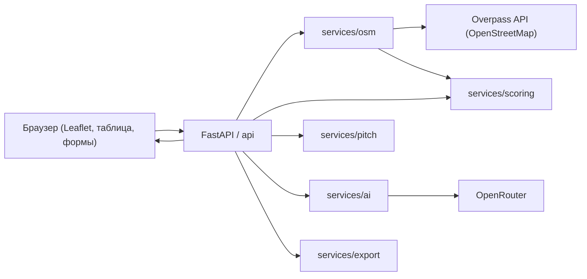

# LeadAnalytics

Веб-приложение на FastAPI для поиска локального бизнеса в OpenStreetMap, оценки его «аналитического потенциала» и генерации холодных писем. Инструмент помогает начинающему аналитику данных находить заведения, которым можно бесплатно сделать аналитический проект для портфолио.

[](https://www.python.org/)
[](https://fastapi.tiangolo.com/)
[](LICENSE)
[](.github/workflows/ci.yml)

## Возможности

- Поиск заведений по выбранному городу и категориям через Overpass API (OpenStreetMap), без ключей и прокси.
- Поддержка семи категорий бизнеса: кофейни и кафе, пекарни, кондитерские, рестораны, фастфуд, салоны красоты, цветочные магазины.
- Перебор зеркал Overpass с фолбэком (POST, затем GET), чтобы запрос проходил даже при недоступности части серверов.
- Эвристическая оценка потенциала каждого заведения как клиента: HIGH, MEDIUM или LOW.
- Определение сетевых заведений по тегу `brand` в OSM и по списку известных российских сетей.
- Отображение результатов на интерактивной карте Leaflet и в таблице с поиском и фильтрами (только высокий потенциал, есть контакты, без сетей).
- Генерация холодных писем двумя способами: шаблонные тексты, адаптированные под тип бизнеса, и персональные письма через нейросеть (OpenRouter).
- Экспорт отобранных лидов в CSV или XLSX с русскими заголовками колонок.
- Автоматическая документация API (Swagger UI и ReDoc), предоставляемая FastAPI.

## Скриншот


> Скриншот в репозиторий пока не добавлен. Поместите изображение интерфейса по пути `docs/screenshot.png`, чтобы оно отобразилось здесь.

## Технологический стек

| Слой | Технологии |
| --- | --- |
| Бэкенд | FastAPI, Uvicorn |
| Валидация и конфигурация | Pydantic v2, pydantic-settings |
| Обработка и экспорт данных | Pandas, OpenPyXL |
| HTTP-клиент | Requests |
| Фронтенд | Ванильный JavaScript, Leaflet.js, FontAwesome |
| Источник данных | OpenStreetMap Overpass API |
| Генерация писем нейросетью | OpenRouter |

## Архитектура

Проект разделён на слои: конфигурация и справочные данные, схемы запросов/ответов, слой API и слой сервисов с бизнес-логикой. FastAPI отдаёт REST API под префиксом `/api` и статический фронтенд из каталога `static`.

```
.
├── app/
│   ├── main.py            # Сборка приложения FastAPI, CORS, монтирование статики
│   ├── config.py          # Настройки через переменные окружения (pydantic-settings)
│   ├── constants.py       # Города, категории, сопоставление с тегами OSM
│   ├── schemas.py         # Pydantic-модели запросов и ответов
│   ├── api/
│   │   └── routes.py      # Маршруты REST API (/api/...)
│   └── services/
│       ├── osm.py         # Клиент Overpass API и разбор сырых данных в лиды
│       ├── scoring.py     # Определение сетей и оценка потенциала
│       ├── pitch.py       # Шаблонные письма под тип бизнеса
│       ├── ai.py          # Генерация писем нейросетью через OpenRouter
│       └── export.py      # Выгрузка лидов в CSV/XLSX
├── static/
│   ├── index.html         # Разметка интерфейса
│   ├── style.css          # Стили
│   └── app.js             # Логика фронтенда: карта, таблица, фильтры, экспорт
├── tests/                 # Тесты на pytest (без обращения к сети)
├── main.py                # Точка входа для совместимости (uvicorn main:app)
├── Dockerfile
├── docker-compose.yml
├── Makefile
├── requirements.txt
├── requirements-dev.txt
└── pyproject.toml
```

Поток данных:



## Быстрый старт (локально)

Требуется Python 3.10 или новее.

```bash
# Создание и активация виртуального окружения
python -m venv .venv
source .venv/bin/activate        # Windows: .venv\Scripts\activate

# Установка зависимостей
pip install -r requirements.txt

# Запуск сервера разработки с автоперезагрузкой
uvicorn app.main:app --reload
```

После запуска интерфейс доступен по адресу http://127.0.0.1:8000, а интерактивная документация API — по адресу http://127.0.0.1:8000/docs (Swagger UI) и http://127.0.0.1:8000/redoc.

Часть команд продублирована в `Makefile` (`make install`, `make run`, `make test`, `make lint`).

## Запуск через Docker

```bash
docker compose up --build
```

Приложение будет доступно на порту 8000. Серверный ключ OpenRouter можно передать через переменную окружения `OPENROUTER_API_KEY` (см. ниже) — она пробрасывается в контейнер из окружения хоста.

## Конфигурация

Настройки читаются из переменных окружения или файла `.env` в корне проекта (см. `.env.example`). Все параметры необязательны — приложение запускается со значениями по умолчанию.

| Переменная | Назначение | Значение по умолчанию |
| --- | --- | --- |
| `OPENROUTER_API_KEY` | Серверный ключ OpenRouter для генерации писем нейросетью | не задан |
| `OPENROUTER_DEFAULT_MODEL` | Модель по умолчанию для генерации писем | `openai/gpt-oss-20b:free` |
| `CORS_ORIGINS` | Список разрешённых источников CORS | `["*"]` |

В `app/config.py` доступны и другие параметры (зеркала Overpass, таймауты запросов, базовый URL OpenRouter), которые при необходимости также переопределяются переменными окружения.

Ключ OpenRouter можно задать двумя способами:

- На сервере — через `OPENROUTER_API_KEY`. Тогда пользователям не нужно вводить ключ вручную.
- В интерфейсе — пользователь вводит свой ключ в браузере, и тот сохраняется в `localStorage` и передаётся вместе с запросом генерации.

Ключи не коммитятся в репозиторий: файл `.env` исключён через `.gitignore`, а в репозитории лежит только шаблон `.env.example` без секретов.

## Справочник API

Все маршруты доступны под префиксом `/api`.

| Метод | Путь | Назначение |
| --- | --- | --- |
| GET | `/api/health` | Проверка доступности сервиса и версии |
| GET | `/api/cities` | Список городов, доступных для поиска |
| GET | `/api/categories` | Список категорий бизнеса |
| POST | `/api/search` | Поиск заведений через Overpass и оценка их потенциала |
| POST | `/api/pitch` | Генерация шаблонного письма под тип бизнеса |
| POST | `/api/pitch/ai` | Генерация персонального письма нейросетью через OpenRouter |
| POST | `/api/export` | Выгрузка выбранных лидов в CSV или XLSX |

Полные схемы запросов и ответов описаны Pydantic-моделями в `app/schemas.py` и автоматически отображаются в Swagger UI на `/docs`.

## Как это работает: скоринг потенциала

Оценка потенциала рассчитывается в `app/services/scoring.py` по простой эвристике. Сначала определяется, является ли заведение сетью: признаком считается заполненный тег `brand` в OpenStreetMap или совпадение названия со списком известных российских сетей и франшиз. Затем выставляется итоговая оценка:

- **HIGH** — независимый бизнес, у которого указаны и сайт, и телефон. Высокая вероятность, что есть учётная или кассовая система с накопленными данными, но нет штатного аналитика. Это основная цель.
- **MEDIUM** — независимый бизнес, у которого доступен только один канал связи (либо сайт, либо телефон).
- **LOW** — крупная сеть (как правило, имеет собственный отдел аналитики и CRM) либо заведение без каких-либо контактов на карте, с которым сложно связаться.

Логика устроена так, что отсутствие данных в OSM понижает оценку, а полнота контактов у одиночного заведения — повышает.

## Методология: как искать первых клиентов

Назначение инструмента — помочь начинающему аналитику набрать реальные кейсы. Ниже краткая методология использования.

### Каких клиентов искать

Ориентируйтесь на заведения с оценкой HIGH: независимые одиночные кофейни, пекарни, салоны и т. п., у которых есть и сайт, и телефон. У них обычно установлена учётная система, в которой копятся данные, но нет бюджета на штатного аналитика. Заведения MEDIUM подходят тоже, но с ними сложнее связаться. Сети (LOW) для первых проектов малоперспективны: у них есть собственные специалисты.

### Как связаться

- Онлайн: выберите заведение с высоким потенциалом, сгенерируйте письмо (шаблонное или через нейросеть) и отправьте его через форму на сайте заведения или по электронной почте.
- Офлайн: найдите на карте заведение рядом с домом или учёбой, зайдите туда и попросите связать вас с управляющим или владельцем. Предложите бесплатно помочь с аналитикой в обмен на отзыв и кейс в портфолио.

### Какие учётные системы обычно используются

- Кофейни, кафе, рестораны, фастфуд: iiko, r-keeper, Poster, Quick Resto, 1С.
- Салоны красоты: YClients, Altegio.
- Цветочные и мелкий ритейл: 1С, МойСклад.

### Какие данные просить

Доступ к чужим аккаунтам не нужен. Достаточно попросить владельца выгрузить обезличенный файл в Excel или CSV за последние 3–6 месяцев:

- Для общепита: продажи по чекам (дата, время, позиция, количество, цена, по возможности себестоимость).
- Для услуг: журнал записей и история визитов (обезличенный идентификатор клиента, дата, услуга, мастер, статус, стоимость).

### Какие кейсы делать

- ABC/XYZ-анализ меню или ассортимента: какие позиции дают основную прибыль, а какие списываются.
- Прогнозирование спроса для планирования закупок и снижения списаний.
- RFM-анализ и сегментация клиентов для адресных рассылок.
- Анализ совместных покупок (market basket) для комбо-предложений и допродаж.
- Интерактивный дашборд с ключевыми метриками и текстовый отчёт с рекомендациями.

По итогам работы попросите у владельца письменный отзыв. Кейс с графиками, описанием работы и отзывом реального бизнеса заметно усиливает портфолио кандидата на позицию Junior Data Analyst.

## Тестирование

Тесты написаны на pytest и не обращаются к сети: запросы к Overpass подменяются фикстурами, а скоринг и обработка данных проверяются на синтетическом ответе Overpass.

```bash
# Установка зависимостей для разработки (тесты, линтер)
pip install -r requirements-dev.txt

# Запуск тестов
pytest

# Проверка линтером
ruff check .
```

Покрыты обработка ответа Overpass и построение запроса (`tests/test_osm.py`), логика определения сетей и скоринга (`tests/test_scoring.py`), а также HTTP-эндпоинты через FastAPI TestClient (`tests/test_api.py`).

Непрерывная интеграция настроена в `.github/workflows/ci.yml`: при push и pull request в ветку `main` запускаются проверка `ruff` и `pytest`.

## Возможные улучшения

- Кэширование ответов Overpass для повторных запросов по тому же городу и категориям.
- Перевод сетевых вызовов (Overpass, OpenRouter) на асинхронный клиент, например httpx.
- Расширение списка городов через геокодер вместо фиксированного справочника.
- Добавление базы данных для сохранения найденных лидов и отслеживания статуса работы с ними.
- Расширение эвристики скоринга (учёт режима работы, наличия меню, рейтингов).

## Лицензия

Проект распространяется под лицензией MIT. Полный текст — в файле [LICENSE](LICENSE).
