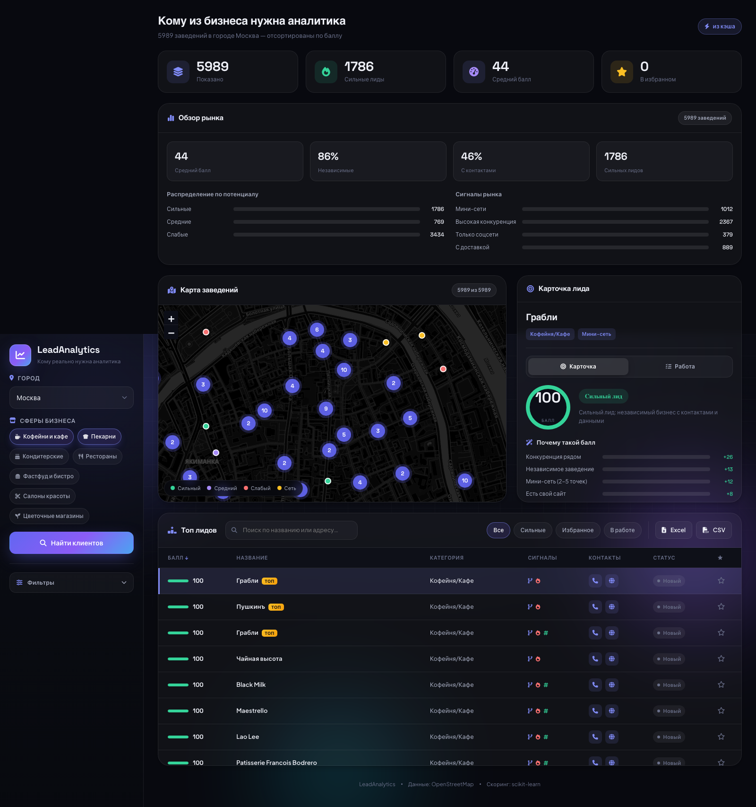

# LeadAnalytics

Веб-приложение на FastAPI, которое находит локальный бизнес в OpenStreetMap и ранжирует его по тому, насколько заведению нужна аналитика. Аналитик открывает приложение, фильтрует выдачу и сразу видит топ заведений, которым можно предложить проект для портфолио, с понятным «почему» и «что предложить».

[](https://www.python.org/)
[](https://fastapi.tiangolo.com/)
[](https://scikit-learn.org/)
[](LICENSE)
[](.github/workflows/ci.yml)

## Возможности

- Поиск заведений по городу и категориям через Overpass API (OpenStreetMap), без ключей и прокси.
- ML-скоринг потенциала 0–100 (scikit-learn) с разбором вклада факторов по каждому лиду.
- Сигналы из данных: плотность конкурентов рядом, мини-сети (2–5 точек), соцсети без сайта, email, часы работы, доставка, кухня.
- Фильтры: минимальный балл, наличие каналов связи, только независимые, поиск в радиусе от точки на карте.
- Карта с кластеризацией маркеров (Leaflet) и ранжированная таблица с сортировкой по баллу.
- Мини-CRM в отдельной вкладке карточки: статусы лида, избранное и заметки, сохраняются в браузере; экспорт их учитывает.
- Обзор рынка по текущей выборке (учитывает фильтры): средний балл, доля независимых, контактность, распределение по потенциалу и сигналы рынка.
- Фильтры сворачиваются, статичное левое меню; статистика пересчитывается под активные фильтры.
- Карточка лида с планом «что предложить» под конкретный бизнес и подсказками, как выйти на контакт.
- Кэширование повторных запросов и экспорт лидов в CSV/XLSX.

## Скриншот



## Стек

Бэкенд — FastAPI, Pydantic v2, pydantic-settings, Uvicorn. Скоринг — scikit-learn, NumPy. Данные — Pandas, OpenPyXL, Requests. Фронтенд — ванильный JavaScript, Leaflet.js (+ markercluster). Источник данных — OpenStreetMap Overpass API.

## Структура

```
app/
  main.py            Сборка приложения, CORS, отдача статики
  config.py          Настройки через переменные окружения
  constants.py       Города, категории, маппинг тегов OSM
  schemas.py         Pydantic-модели запросов и ответов
  api/routes.py      Маршруты REST API (/api/...)
  services/          osm, scoring, overview, export, cache
  ml/                features, model, train (модель скоринга)
static/              Фронтенд (HTML, CSS, JS, карта Leaflet)
analysis/            EDA-ноутбук и выгрузки данных
tests/               Тесты на pytest (офлайн, без сети)
```

## Быстрый старт

Требуется Python 3.10+.

```bash
python -m venv .venv
source .venv/bin/activate          # Windows: .venv\Scripts\activate
pip install -r requirements.txt
uvicorn app.main:app --reload
```

Интерфейс — http://127.0.0.1:8000, документация API — http://127.0.0.1:8000/docs.
Через Docker: `docker compose up --build`.

## Как работает скоринг (ML)

Балл считается моделью scikit-learn (`app/ml/`): пайплайн `StandardScaler + LogisticRegression` над инженерными признаками лида (контакты, независимость, мини-сеть, конкуренция и т.д.).

Размеченных данных «клиент согласился» в открытом доступе нет, поэтому модель обучается методом weak supervision — на синтетической выборке, сгенерированной из доменных правил с реалистичным шумом и взаимодействиями признаков (ROC-AUC порядка 0.88 на отложенной выборке). Линейные коэффициенты дают честное объяснение вклада каждого признака для конкретного лида — это и показывает блок «Почему такой балл». Если scikit-learn недоступен, скоринг автоматически переходит на прозрачную эвристику.

Уровни: HIGH (балл ≥ 65), MEDIUM (40–64), LOW (< 40). Для сетей действует жёсткий потолок — у них обычно уже есть свой аналитик.

Переобучить модель и посмотреть метрики:

```bash
python -m app.ml.train
```

## API

Все маршруты под префиксом `/api`.

| Метод | Путь | Назначение |
| --- | --- | --- |
| GET | `/api/health` | Проверка доступности и версии |
| GET | `/api/cities` | Список городов |
| GET | `/api/categories` | Список категорий |
| POST | `/api/search` | Поиск, ML-скоринг и обзор рынка |
| POST | `/api/export` | Выгрузка лидов в CSV/XLSX |

## Конфигурация

Настройки читаются из переменных окружения или файла `.env` (шаблон — `.env.example`). Все необязательны.

| Переменная | Назначение | По умолчанию |
| --- | --- | --- |
| `CORS_ORIGINS` | Разрешённые источники CORS | `["*"]` |
| `CACHE_TTL` | Время жизни кэша поиска, сек | `600` |

## Методология

Цель — быстро найти, кому из бизнеса предложить бесплатный аналитический проект за отзыв и кейс. Ориентируйтесь на лиды с высоким баллом: независимые заведения с контактами и данными, но без штатного аналитика. Карточка лида подсказывает, что именно предложить (ABC/XYZ-анализ меню, прогноз спроса, RFM-сегментация, сравнение точек мини-сети и т.д.) и как выйти на контакт — онлайн или лично. Достаточно попросить у владельца обезличенную выгрузку чеков или журнала записей за 3–6 месяцев.

## Тестирование

Тесты на pytest не обращаются к сети (Overpass подменяется фикстурой).

```bash
pip install -r requirements-dev.txt
pytest
ruff check .
```

CI (`.github/workflows/ci.yml`) запускает ruff и pytest на push и pull request в `main`.

## Лицензия

MIT, см. [LICENSE](LICENSE).
